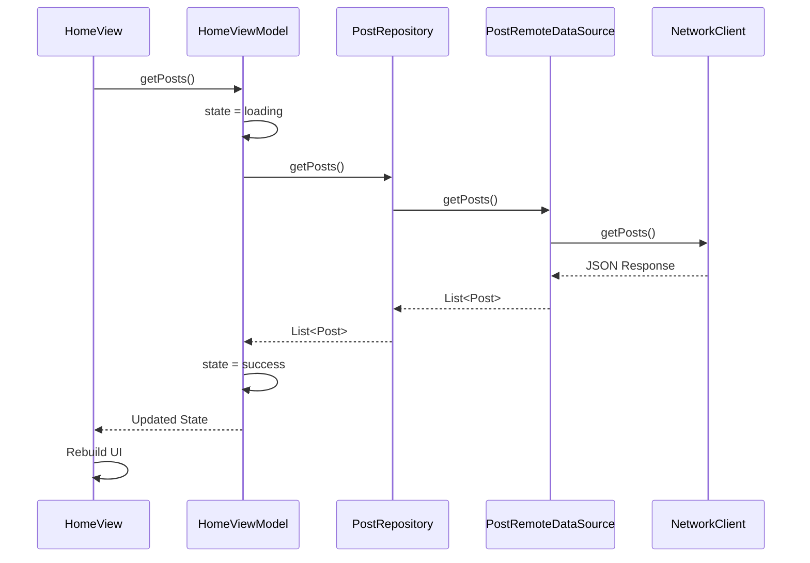

# Flutter MVVM with Riverpod Boilerplate

A Flutter boilerplate project that provides a clean, scalable foundation using MVVM (Model-View-ViewModel) architecture pattern and Riverpod for state management.

## Features

- MVVM Architecture
- Riverpod for State Management
- Theme Support (Light/Dark)
- Internationalization (i18n)
- Auto Route Navigation
- Network Layer with Dio & Retrofit
- Local Storage with Shared Preferences
- Code Generation Support
- Asset Management

## Project Structure

```text
lib/
├── assets/
│   ├── icons/
│   │   ├── svg/          # SVG icons
│   │   └── other/        # Other format icons
│   └── images/
│       ├── svg/          # SVG images
│       └── other/        # Other format images
│
├── core/
│   ├── common/
│   │   └── widgets/      # Shared widgets
│   ├── constants/        # App constants
│   ├── di/              # Dependency injection
│   ├── i18n/            # Internationalization
│   ├── network/         # Network configuration
│   ├── storage/         # Local storage
│   ├── theme/           # Theme configuration
│   └── utils/           # Utility functions
│
├── features/
│   └── home/
│       ├── data/
│       │   ├── datasources/
│       │   │   └── post_remote_data_source.dart
│       │   └── repositories/
│       │       └── post_repository_impl.dart
│       │
│       ├── domain/
│       │   ├── entities/
│       │   │   └── post.dart
│       │   └── repositories/
│       │       └── post_repository.dart
│       │
│       └── presentation/
│           ├── viewModels/
│           │   ├── home_state.dart
│           │   └── home_view_model.dart
│           └── views/
│               └── home_view.dart
│
├── routes/              # App navigation
└── main.dart
```

## Data Flow

### Request Flow

1. **View Layer (UI)**

   - User interactions trigger actions in the View
   - View calls ViewModel methods

2. **ViewModel Layer**

   - Handles business logic
   - Updates state using Riverpod
   - Calls repository methods

3. **Repository Layer**

   - Coordinates data operations
   - Decides data source (remote/local)
   - Calls appropriate data source

4. **Data Source Layer**
   - Handles raw data operations
   - Makes API calls using NetworkClient
   - Converts raw data to entities

### Response Flow

1. **Data Source Layer**

   - Receives raw API response
   - Handles errors and exceptions
   - Converts response to domain entities

2. **Repository Layer**

   - Receives entities from data source
   - Performs any necessary data transformations
   - Forwards data to ViewModel

3. **ViewModel Layer**

   - Updates state with new data
   - Handles loading and error states
   - Notifies View of changes

4. **View Layer**
   - Observes state changes via Riverpod
   - Updates UI based on new state
   - Shows loading/error states

### Example Flow: Fetching Posts



## Dependencies

```yaml
dependencies:
  flutter:
    sdk: flutter
  # State Management
  flutter_riverpod: ^2.6.1
  riverpod_annotation: ^2.3.5

  # Navigation
  auto_route: ^7.8.4

  # Network
  dio: ^5.4.1
  retrofit: ^4.1.0

  # Local Storage
  shared_preferences: ^2.2.2

  # Internationalization
  easy_localization: ^3.0.5

  # UI
  google_fonts: ^6.1.0
  flutter_svg: ^2.0.10+1

dev_dependencies:
  # Code Generation
  build_runner: ^2.4.8
  auto_route_generator: ^7.3.2
  retrofit_generator: ^8.1.0
  riverpod_generator: ^2.3.5
```

## Architecture Overview

### Core Layer

- **DI (Dependency Injection)**: Uses Riverpod for dependency injection and state management
- **Network**: Handles API communication using Dio with interceptors and Retrofit
- **Storage**: Manages local storage using SharedPreferences
- **Theme**: Supports light and dark themes with Material 3
- **i18n**: Handles internationalization with easy_localization

### Feature Layer (per feature)

1. **Data Layer**

   - **Data Sources**: Implements data fetching from remote/local sources
   - **Repositories**: Implements repository interfaces from domain layer

2. **Domain Layer**

   - **Entities**: Contains business models
   - **Repositories**: Defines repository interfaces

3. **Presentation Layer**
   - **ViewModels**: Contains business logic and state management
   - **Views**: Contains UI components
   - **States**: Manages UI states

## Scripts

The project includes several utility scripts in the `scripts/` directory:

- `build_runner.sh`: Runs code generation
- `i18n_generate_code_loader.sh`: Generates i18n loader code
- `i18n_generate_locale_keys.sh`: Generates locale keys
- `generate_assets_constant_file.sh`: Generates asset constants

## Getting Started

1. Clone the repository

```bash
git clone https://github.com/yourusername/flutter_mvvm_riverpod_boilerplate.git
```

2. Install dependencies

```bash
flutter pub get
```

3. Run code generation

```bash
# For one-time code generation
flutter pub run build_runner build --delete-conflicting-outputs

# For continuous code generation during development
flutter pub run build_runner watch
```

4. Generate i18n files

```bash
flutter pub run easy_localization:generate -S "lib/core/i18n/langs" -O "lib/core/i18n/generated"
flutter pub run easy_localization:generate -S "lib/core/i18n/langs" -O "lib/core/i18n/generated" -o "locale_keys.dart" -f keys
```

5. Generate assets constants

```bash
sh scripts/generate_assets_constant_file.sh
```
