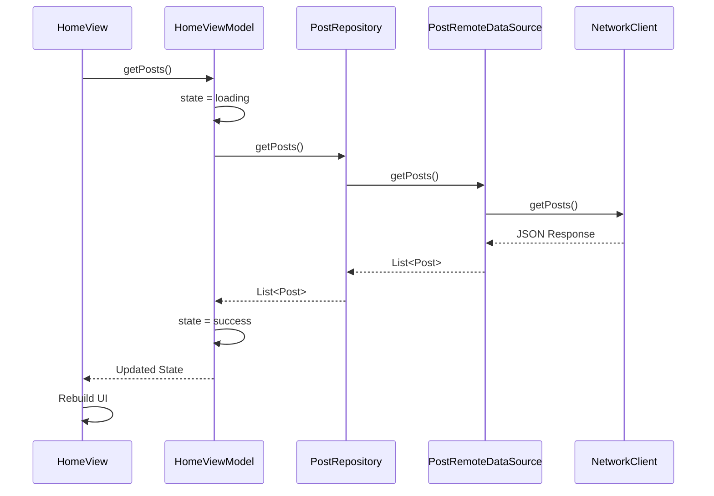

# Flutter MVVM with Riverpod Boilerplate

A Flutter boilerplate project that provides a clean, scalable foundation using MVVM (Model-View-ViewModel) architecture pattern and Riverpod for state management.

## Project Structure

```text
lib/
├── core/
│   ├── di/
│   │   ├── providers.dart           # Dependency injection providers
│   │   └── providers.g.dart         # Generated provider code
│   └── network/
│       ├── dio_config.dart          # Dio HTTP client configuration
│       ├── dio_interceptors.dart    # Network interceptors
│       ├── network_client.dart      # REST API client
│       └── network_client.g.dart    # Generated API client code
│
└── features/
    └── home/
        ├── data/
        │   ├── datasources/
        │   │   └── post_remote_data_source.dart    # Remote data source implementation
        │   └── repositories/
        │       └── post_repository_impl.dart        # Repository implementation
        │
        ├── domain/
        │   ├── entities/
        │   │   └── post.dart        # Domain entities
        │   └── repositories/
        │       └── post_repository.dart    # Repository interfaces
        │
        └── presentation/
            ├── viewModels/
            │   ├── home_state.dart         # State management
            │   ├── home_view_model.dart    # Business logic
            │   └── home_view_model.g.dart  # Generated ViewModel code
            └── views/
                └── home_view.dart          # UI components
```

## Data Flow

### Request Flow

1. **View Layer (UI)**
   - User interactions trigger actions in the View
   - View calls ViewModel methods

2. **ViewModel Layer**
   - Handles business logic
   - Updates state using Riverpod
   - Calls repository methods

3. **Repository Layer**
   - Coordinates data operations
   - Decides data source (remote/local)
   - Calls appropriate data source

4. **Data Source Layer**
   - Handles raw data operations
   - Makes API calls using NetworkClient
   - Converts raw data to entities

### Response Flow

1. **Data Source Layer**
   - Receives raw API response
   - Handles errors and exceptions
   - Converts response to domain entities

2. **Repository Layer**
   - Receives entities from data source
   - Performs any necessary data transformations
   - Forwards data to ViewModel

3. **ViewModel Layer**
   - Updates state with new data
   - Handles loading and error states
   - Notifies View of changes

4. **View Layer**
   - Observes state changes via Riverpod
   - Updates UI based on new state
   - Shows loading/error states

### Example Flow: Fetching Posts



## Architecture Overview

This project follows the MVVM (Model-View-ViewModel) architecture pattern with a clean architecture approach:

### Core Layer

- **DI (Dependency Injection)**: Uses Riverpod for dependency injection and state management
- **Network**: Handles API communication using Dio with interceptors and REST client

### Feature Layer (per feature)

1. **Data Layer**

   - **Data Sources**: Implements data fetching from remote/local sources
   - **Repositories**: Implements repository interfaces from domain layer

2. **Domain Layer**

   - **Entities**: Contains business models
   - **Repositories**: Defines repository interfaces

3. **Presentation Layer**
   - **ViewModels**: Contains business logic and state management
   - **Views**: Contains UI components
   - **States**: Manages UI states

## Key Components

### Network

- Uses Dio for HTTP communications
- Implements interceptors for logging and error handling
- Uses Retrofit for type-safe API calls

### State Management

- Uses Riverpod for state management
- Implements state classes for each feature
- Uses generated providers for dependency injection

### Error Handling

- Custom exception handling in data sources
- Error states in ViewModels
- UI error feedback in Views

## Dependencies

Main dependencies used in this project:

- `flutter_riverpod`: State management and dependency injection
- `dio`: HTTP client
- `retrofit`: Type-safe HTTP client
- `shared_preferences`: Local storage

## Getting Started

1. Clone the repository
2. Run `flutter pub get` to install dependencies
3. Run `flutter pub run build_runner build` to generate code
4. Run the app using `flutter run`

## Code Generation

This project uses code generation for Riverpod providers and Retrofit client. To generate the required code, run:

```bash
flutter pub run build_runner build
```

Or for continuous generation during development:

```bash
flutter pub run build_runner watch
```
